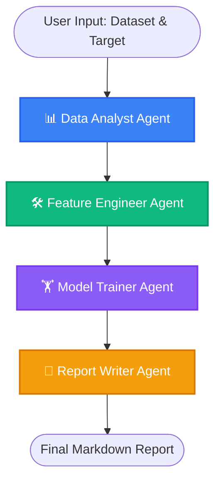

# Auto-ML Multi-Agent System 🤖🚀

An automated Machine Learning pipeline powered by a team of AI Agents. Built using **LangGraph**, **Groq (Llama-3.3-70b)**, and **Streamlit**, this system autonomously takes a raw dataset, analyzes it, engineers features, trains models, and generates a comprehensive final report.

## 🌟 Features
- **Fully Autonomous ML Pipeline**: Just provide your dataset and the target column, and let the agents handle the rest.
- **Multi-Agent Architecture**: 4 specialized agents working sequentially to build the best model.
- **Interactive UI**: A beautiful Streamlit dashboard to monitor progress and interact with the pipeline.
- **Comprehensive Reporting**: Automatically generates an easy-to-read Markdown report (`final_report.md`) detailing data insights, preprocessing steps, and model performance.

## 🧠 The Agent Workflow

The system is orchestrated using `langgraph` and consists of 4 specialized agents acting in sequence.



### Agent Roles:
1. **📊 Data Analyst Agent**: Scans the dataset, handles missing values, identifies column types, and uncovers initial insights.
2. **🛠️ Feature Engineer Agent**: Processes the data, applies necessary transformations, scales numerical features, and encodes categorical data.
3. **🏋️ Model Trainer Agent**: Trains multiple machine learning models using 5-fold cross-validation, evaluates performance, and selects the absolute best-performing model.
4. **📝 Report Writer Agent**: Compiles all the findings, preprocessing steps, and model metrics into a professional, human-readable final report.

## ⚙️ Tech Stack
- **Framework**: [LangGraph](https://python.langchain.com/docs/langgraph) & [LangChain](https://python.langchain.com/)
- **LLM**: [Groq](https://groq.com/) API (Llama-3.3-70b-versatile)
- **Frontend**: [Streamlit](https://streamlit.io/)
- **Data & ML**: Pandas, NumPy, Scikit-Learn

## 🚀 Getting Started

### 1. Prerequisites
Ensure you have Python installed (e.g. Python 3.10+).

### 2. Installation
Clone the repository and install the required dependencies:
```bash
# Create a virtual environment (optional but recommended)
python -m venv .venv

# Activate the virtual environment
# On Windows:
.venv\Scripts\activate
# On Mac/Linux:
source .venv/bin/activate

# Install dependencies
pip install -r requirement.txt
```

### 3. Environment Variables
Create a `.env` file in the root directory and add your Groq API key:
```env
GROQ_API_KEY=your_groq_api_key_here
```

### 4. Run the Application
Start the Streamlit UI to interact with the agents:
```bash
streamlit run ui/app.py
```

## 📄 License
MIT License
